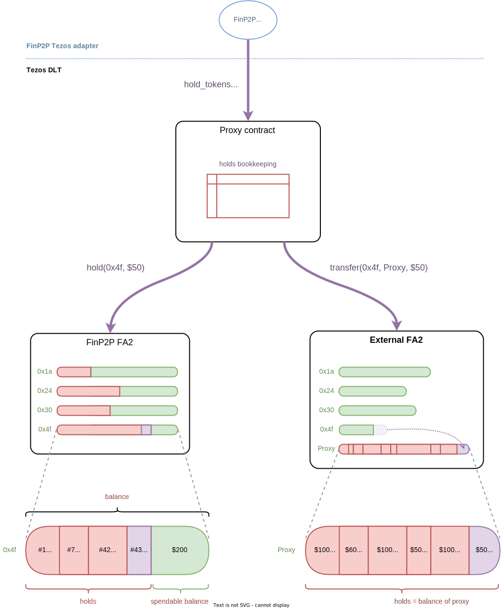

# Hold and Release for FinP2P Assets

FinP2P assets can represent digital securities but also currencies. This means
that they can be used as a payment mechanism (to settle an asset transfer in
another DLT for instance).

To support this process, additional functionality needs to be added to the asset
tokens smart contracts on the Tezos side. There are two ways to proceed
depending on the guarantees and flexibility that we seek.

## Escrow VS. Hold

### Escrow

FinP2P assets can be moved to an _escrow contract_ which will take care of
holding the tokens. The tokens put in escrow can then be moved to their
destination when the settlement takes place, or they can be returned to the
original owner if it expires or if it is canceled.

With an escrow mechanism, the funds have to be **moved out** from the owners
account to the escrow contract. To an outside observer, it looks like the owner
does not possess the tokens that are in escrow, so in particular, this means
that any (on-chain or off-chain) mechanism which incurs dividends for the
tokens/assets of an owner will not work directly.

The advantage of using an escrow contract is that any (FA2) token can be used as
a settlement currency. This would allow in particular users who own one of the
stable coin on Tezos (such as [USDtz](https://usdtz.com/),
[kUSD](https://kolibri.finance/), [uUSD](https://youves.com/), wrapped USDC
tokens, or [USDC](https://www.circle.com/en/usdc) if it supports Tezos in the
future), to make payment on FinP2P directly.


### Hold and Release

In order for the owners to keep their tokens in their account, one must
implement a hold mechanism on the token natively. This means that tokens never
leave a users account, but instead the FA2 token contract (or an external
coupled one) keeps track of holds that are opened for every user and every
tokens. The FA2 contract then ensures that only funds that are not on hold can
be moved out of an account (in an asset transfer, or asset redeem operation for
instance).

The advantage of this approach, is that the tokens and value stay in possession
of the user when they are put on hold, which allows external mechanisms (_e.g._,
for dividends) to work unchanged. Because all the information about the tokens
are kept in the same place, it is also easier to retrieve what is relevant for
applications (for instance, the number of held tokens for user, _etc._).

The drawback is that only tokens that natively support this hold mechanism can
be used. For the FinP2P application, this means that the organizations will need
to issue the tokens that represent FIAT currency themselves. (But note that
these tokens will be subject to the same constraints as the FinP2P security
tokens, and in particular they will not be exchangeable freely.)

The constraint that users keep their held tokens in their account is
important for _security_ assets (_e.g._, like the assets created by
organizations in FinP2P) but it is not so much important for tokens that
represent a payment currency (such as stable coins).

This is why we propose to have a hybrid mechanism where external (to FinP2P) FA2
assets on Tezos (like stable coins) will be held in an escrow contract whereas
FinP2P assets tokens will be held with a _built-in_ hold and release mechanism
in the FA2 smart contract.




## Native Hold in FA2 Asset Contract

The proposed solution is similar to the
[UniversalToken](https://github.com/ConsenSys/UniversalToken) developed by
Consensys on the Ethereum blockchain, with the difference that our solution is
lower level and only provides the necessary basic building blocks for a hold
mechanism.

We extend the FA2 contract with three additional entry points:

- `hold` to put tokens on hold,
- `rollback` to return tokens on hold back to their owner,
- `release` to release a on hold.

Additional views are also provided to query the balance and total number of
tokens on hold for a specific user and token.

To keep track of this information we must augment the storage with the following
fields:
- `holds` :  a big map from unique `hold_id`s to hold information to store each
  new hold that is made,
- `holds_totals` : a big map from address and token id to an amount that
  represent the total number of tokens (of this token id) on hold for a given user,
- `max_hold_id` : a global incrementing counter to generate new fresh hold_ids.


### `hold`

```ocaml
type hold = {
  token_id : token_id;
  amount : token_amount;
  src : address;
  dst : address option;
}

type hold_param = { id : hold_id option; hold : hold }

let hold (h : hold_param) (s : storage) : storage = ...
```

This entry point has the same authorization policy as the `transfer` entry
point. This means that it can be called by the proxy contract or an accredited
user. For this reason it is grouped with what we call the asset entry points of
the FA2 contract (namely `transfer`, `add/remove_operator`, `balance_of`).

#### Spec

The `hold` entry point checks that the `hold_id`, when provided, is strictly
greater than `max_hold_id`. This prevents reusing released (or rolled back) hold
ids. If the hold_id is not provided, a fresh hold id is computed as
`max_hold_id + 1`.

Note that when a user provides his or her own hold id, the transaction is
subject to _front running_ attacks. It is possible for an attacker to make all
these hold operations fail by monitoring the mempool and injecting hold
transactions (of say 0 tokens) with the same `hold_id`. This is not a problem in
our solution with the proxy because the hold operation is internal and the hold
id is computed dynamically.

The hold information is then stored in the `holds` table. And finally, the total
held for the user is incremented with the hold amount in the table `holds_totals`.

### `rollback`

```ocaml
type rollback_param = { 
  hold_id : hold_id; 
  amount : token_amount option;
  token_id : token_id option;
  src : address option;
}

let rollback (r : rollback_param) (s : storage) : storage =
```

The authorization policy for this entry point restricts calls to be made only by
the proxy.

#### Spec

Calling `rollback` will remove the hold (if no amount is provided or if the
amount is the one of the hold) or decrement the hold, effectively returning the
held tokens to the original user.

When provided, `token_id` and `src` must match the one of the hold.

If the `amount` is smaller than the amount of the hold (it cannot be greater),
then the hold remains active, but is decremented by the rollbackd amount. In this
case we talk about a _partial rollback_ of the tokens.


### `release`

```ocaml
type release_param = { 
  hold_id : hold_id; 
  amount : token_amount option;
  token_id : token_id option;
  src : address option;
  dst : address option;
}

let release (e : release_param) (s : storage) : storage =
```

The authorization policy for this entry point restricts calls to be made only by
the proxy.

#### Spec

Calling `release` will remove the hold (if no amount is provided or if the
amount is the one of the hold) or decrement the hold, and transfer the released
amount to the intended destination.

It is important to remove the hold before transferring the tokens to be able to
reuse the internal transfer function and ensure it goes through.

When provided, `token_id` and `src` must match the one of the hold.

When the hold was not registered with a destination, `dst` must be provided. (It
can also be provided if there is a destination in the hold, but it must be
identical.)

If the `amount` is smaller than the amount of the hold (it cannot be greater),
then the hold remains active, but is decremented by the released amount. In this
case we talk about a _partial hold release_.


### Modifications to the Other Entry Points

The entry points of the contract which transfer funds out of an account must
ensure that only the tokens that are not on hold are transferred. We talk about
the _spendable_ balance of an account (the full balance minus the total tokens
on hold).

In the case of our FA2, only the entry points `transfer` and `burn` needs to be
modified to ensure that the transferred (resp. burned) tokens are within the
spendable balance of the source account.


## Escrow of External Tokens

Instead of deploying one (or multiple) _escrow contracts_ we propose that the
**Proxy** contract also plays to role of escrow. This presents the following
advantages:

1. The information about escrowed tokens is directly available to the Proxy.
2. This reduces the number of internal calls (which reduces the gas used and so
   the fees).
3. This prevents having to add an indirection for the hold ids (or to store the
   information about the hold twice) which reduces the amount of data stored on
   chain and in turn also reduces the fees of the hold operations.
4. It is conceptually simpler. This 
   
The only drawback is that if the proxy is changed, the holds that are currently
opened will be lost or we will have to migrate them over to the new proxy
contract. We consider that an acceptable trade-off considering the advantages
listed above.

### Adding Support for Escrow in the Proxy Contract

We store the information about holds in a new big map of the storage called
`holds`. This is used both for tokens that were put on hold through a [native
FA2 hold](#native-hold-in-fa2-asset-contract) or an
[escrow](#escrow-of-external-tokens).

```ocaml
type hold_info = FA2_hold of fa2_native_hold_info | Escrow of escrow_hold_info

```

For a native FA2 hold, we only store the hold id on the FA2 and the token
(address + id).

```ocaml
type fa2_native_hold_info = {
  fa2_hold_id : hold_id; 
  held_token : fa2_token;
}
```

For an escrow we store the token (address + id) and the relevant information
about the hold, _i.e._ the amount the source of the hold and the potential
destination. Note that we do not store the expiry timestamp as it only used for
the signature check.

```ocaml
type escrow_hold_info = {
  held_token : fa2_token;
  amount : token_amount;
  src_account : key;
  dst_account : key option;
}
```

We also store the totals of tokens in escrow for a user and a given token in a
big map `escrow_totals`. The amount that are on hold is the sum of what is in
escrow on the Proxy contract and what is on hold in the FA2 contract. (However a
given token cannot be both put in escrow and on hold natively, as the proxy will
always [prefer native holds](#hold_tokens) when possible.)

The way the escrow operates is described in more details in the [next
section](#proxy-hold), but we give a high level overview of the general idea.

A hold operation put tokens in escrow by transferring them to the Proxy contract
(_i.e._ the tokens are owned by the proxy contract in the token's FA2 ledger). A
rollback makes the proxy transfer the token back to the original owner, while a
hold release makes the proxy transfer the tokens to their intended destination.

### Working with External Addresses

Let's take the case of Alice who possesses USDtz on Tezos and wants to use them
to make a payment to Bob in exchange of another asset. Even if Alice already has
a FinP2P account, she does not have access to the associated private key, and
the FinP2P Tezos adapter cannot, in general, make actions on FA2 contracts which
were not deployed through FinP2P. However, Alice should _authorize the FinP2P
Proxy contract_ to be an operator (this is done with the `add_operator` in
FA2 contracts) and to act on her behalf on her USDtz account (she can also move
the funds she wants to allocate to another addresses she controls). The FinP2P
server must now register Alice's USDtz (Tezos) address as being her own in the
Proxy contract.

Once this is done the proxy contract can emit operations on the FA2 contract
which transfer tokens outside of Alice's account. In particular, the proxy
contract can reflect the movement of FinP2P assets, put the tokens in escrow,
_etc_.


<a id="proxy-hold">

## FinP2P Hold and Release in Proxy Contract

To support these new features the Proxy contract is augmented with three new
entry points:

- `hold_tokens` (put tokens on hold)
- `release_hold` (transfer tokens on hold)
- `rollback_hold` (return tokens to owner)

Only the `hold_tokens` entry point requires a signature from a FinP2P user. The
other entry points are called a FinP2P admin account, which in this case acts as
a _notary_ for the hold (the FinP2P network takes care of solving disputes,
_etc_.).

The implementation for these entry points depends on if the held tokens are a
FinP2P asset or an external asset (in which case they must go through an
[escrow](#escrow-contract)).

To make this information known to the outside (either by other contracts, or by
off-chain applications), the proxy contract needs to provide enriched views
which give the information about tokens on hold for users.

We propose to keep `get_asset_balance` unchanged, _i.e._ returns the full
balance of a user for a given asset. And we propose to add
`get_asset_spendable_balance` which returns the balance that can be transferred
out (_i.e._ without the tokens on hold) and a new view `get_asset_balance_info`
which returns both the full balance and the total amount of this asset on hold
for a given user.

### `hold_tokens`

```ocaml
type supported_hold_dst = 
  | FinId of key
  | Tezos of key_hash

type hold_dst = 
  | Supported of supported_hold_dst 
  | Other of opaque  (* = bytes *)

type hold_ahg = {
  nonce : finp2p_nonce;
  asset_id : asset_id;
  src_account : key;
  dst_account : key;
  amount : opaque;
}

type hold_shg = {
  asset_type : string;
  asset_id : asset_id;
  src_account_type : opaque;
  src_account : opaque;
  dst_account_type : string option;
  dst_account : hold_dst option;
  amount : token_amount;
  expiration : timestamp;
}

type hold_tokens_param = {
  hold_id : finp2p_hold_id; (* = boxed bytes *)
  ahg : hold_ahg;
  shg : hold_shg;
  signature : signature option;
}

let hold_tokens (p : hold_tokens_param) (s : storage) : operation * storage = ...
```

This Tezos operation can be signed/injected by :
1. an administrator: in which case, the signature must be provided,
2. the buyer directly: in which case, no signature is needed but the sender must
   correspond to `ahg.dst_account`.
   
> We allow direct calls to the `hold_tokens` entry point because it allows users
> of an external FA2 token to hold tokens and it does not compromise the
> restrictions put in place. In this case, the proxy contract effectively acts
> as an escrow.

#### Signed Payload

> See [API reference](https://finp2p-docs.ownera.io/reference/transfertoken) in
> **BUYERTRANSFERSIGNATURE** and
> [DLT spec](TODO).

hashGroups = hash('BLAKE2B', [AHG, SHG]);

Signature = sign(buyer private secp256k1 key, hashGroups)


##### Asset Hash Group (AHG) structure

AHG = hash('BLAKE2B', [fields by order]);

| order | value | type | comment |
|--|--|--|--|
| 1 | **nonce**       | []byte  |  24 bytes + timestamp on 8 bytes |
| 2 | operation       | utf8 string  | "transfer" |
| 3 | assetType       | utf8 string  | "finp2p" |
| 4 | assetId         | utf8 string  | unique identifier of the asset |
| 5 | srcAccountType  | utf8 string  | "finId" |
| 6 | **srcAccount**  | utf8 string  | source account finId address  |
| 7 | dstAccountType  | utf8 string  | "finId" |
| 8 | **dstAccount**  | utf8 string  | destination account finId address  |
| 9 | amount          | utf8 string  | hex representation of the transfer amount |

##### Settlement Hash Group (SHG) structure

SHG = hash('BLAKE2B', [fields by order]);

| order | value | type | comment |
|--|--|--|--|
| 1 | assetType       | utf8 string  | "finp2p", "fiat", "cryptocurrency" |
| 2 | **assetId**     | utf8 string  | unique identifier of the asset |
| 3 | srcAccountType  | utf8 string  | "finId", "cryptoWallet", "escrow"|
| 4 | srcAccount      | utf8 string  | source account of the asset  |
| 5 | **dstAccountType**  | utf8 string **(OPTIONAL)** | "finId", "cryptoWallet", "escrow"|
| 6 | **dstAccount**      | utf8 string **(OPTIONAL)** | destination account for the asset  |
| 7 | **amount**      | utf8 string  | hex representation of the settlement amount |
| 8	| **expiry**      | utf8 string  | hex representation of the escrow hold expiry value |

In **bold** we give the fields that need to undergo validation in order to check
the signature and correctly put on hold the tokens. This is described in the
next subsection.

Note that we assume that `dstAccountType` and `dstAccount` are optional, meaning
that they can be absent from the SHG, in the case where the hold has no set
destination (the buyer signs the fact that the hold has no preset
destination). Rollback operations for such holds must specify a destination. 

#### Verifying hold signatures

To verify a hold operation signature, one could in principle only to check the
_settlement hash group_. **However, to prevent replay attacks on this hold
operation one must also extract the timestamp from the nonce of the _asset hash
group_ in order to know the operation's live status.**

The `srcAccount` and `dstAccount` in the AHG currently represent a finId account
or wallet. In the SHG there is a notion of other account types, one of those is
an escrow account id, which abstract the underlying account/wallet where the
payment asset (or assets) is been managed. This means that the aforementioned
fields are not necessarily related in the AHG and SHG because of this
abstraction barrier that is internal to the FinP2P system. However, for our
case of settlement with assets or currency on Tezos, the signature must be
produced by the _buyer, i.e._ the `dstAccount` of the transfer in the AHG.

This is why the AHG cannot be given _as is_ to the entry point `hold_tokens` but
we need to at least extract the nonce and the destination account. The rest of
the fields (which do not need validation but are required to reconstruct the
signed message) are given in bytes form.

The entry point performs the following:
1. Check that the operation is still **live**, _i.e._ check that the `timestamp`
   plus the constant `operation_ttl` is still in the future and that the
   `timestamp` is in the past.
3. Recover the AHG by encoding (and hashing) the nonce and the src and owner
   account together with the extra bytes fields.
2. Recover the SHG by encoding (and hashing) the `amount`, `expiration` and
   `asset_id` with the other extra bytes fields.
4. Hash the AHG+SHG (this is in fact the `hashGroup`) and ensure that it
   is not in our `live_operations` table.
4. Register the hash -> timestamp in the `live_operations` table.
   - We store the timestamp rather than the expiry date so that in case the
     `operation_ttl` is updated, the new ttl takes effect immediately (even for
     existing operations).
5. Check that the encoded message was signed by the public key `owner_account`
   (also the field dstAccount of the AHG) which corresponds to the **buyer**.
6. Perform the adequate calls for either [a native hold](#native-hold) or a
   [hold through escrow](#hold-through-escrow) (see below).
     
The destination of the hold is computed as follows:
- If there are no `dstAccount` field in the SHG, the hold has **no
  destination**.
- If the `dstAccountType` of the SHG is supported by the Tezos ledger, the
  destination is `dstAccount` of the SHG:
  - When the type is "finId", the destination is the secp256k1 public key.
  - When the type is "cryptoWallet" the destination is the public key hash
    contained in `dstAccount`. This is a Tezos account address on chain. For the
    purpose of the signature the key hash is the _raw bytes_ (size 20) of the
    public key hash with a prefix of size one for the curve (`01` for
    secp256k1). (If the `dstAccount` contains
    something that is not a Tezos address, the hold will fail. Also note that
    this format can be changed at will before the system is put into production).
- If the `dstAccountType` of the SHG is "escrow" then the funds are held in a
  special FinP2P escrow account, and the destination for the hold is the seller,
  _i.e._ `srcAccount` in the _AHG_.

This is directly reflected in the type `hold_dst` of the `hold_tokens` parameter.
     
#### Native Hold

1. Retrieve the next FA2 hold id and associate it with the finp2p hold id.
2. Call the `hold` entry point of the FA2 contract.

#### Hold through Escrow

1. Store hold information in `holds` table.
2. Call the `transfer` entry point of the FA2 contract to transfer the amount on
   hold for the buyer to the Proxy contract. The proxy contract also plays the
   role of an escrow contract as shown in the [section on
   escrow](#escrow-of-external-tokens).


### `release_hold`

```ocaml
type release_hold_param = {
  hold_id : finp2p_hold_id; (* = boxed bytes *)
  asset_id : asset_id option;  (* = boxed bytes *)
  amount : token_amount option;
  src_account : public_key option;
  dst_account : public_key option;
}

let release_hold (p : release_hold_param) (s : storage) : operation * storage = ...
```

This Tezos operation must be signed/injected by an administrator.

#### Spec for Release Hold

Releasing a hold here means that the FinP2P admin has confirmed the
corresponding sell and so the tokens on hold must be paid to the intended
recipient.

The destination for a hold is optional when it is created. If it was not set at
creation time then the admin must provide a destination (`dst_account`) when
calling `release_hold`.

Only the FinP2P `hold_id` is compulsory. The other information, _i.e._
`asset_id` and `src_account` are used to perform extra checks to ensure that the
values are the expected ones.

The `amount` can be inferior to the amount that was put on hold. In this case,
the release is _partial_, and there is still a hold for the difference.

The `release_hold` works differently if the hold is native to the FA2 or if it
resides in an external **Escrow** contract.

##### Release Native Hold on FA2 

1. Remove `hold_id` association from storage.
2. Call the `release` entry point with corresponding amount and destination.

##### Release Hold by Escrow

1. Remove `hold_id` association from storage.
2. Call the `transfer` entry point of the FA2 to transfer the tokens in escrow
from the proxy contract to the corresponding destination. 


### `rollback_hold`

```ocaml
type rollback_hold_param = {
  hold_id : finp2p_hold_id; (* = boxed bytes *)
  asset_id : asset_id option;  (* = boxed bytes *)
  amount : token_amount option;
  src_account : public_key option;
}

let rollback_hold (p : rollback_hold_param) (s : storage) : operation * storage = ...
```

This Tezos operation must be signed/injected by an administrator.


#### Spec for Rollback Hold

Rolling back a hold happens when the other side of the bargain has not been
fulfilled or if the FinP2P transaction is canceled. This event is initiated by
the notary (_i.e._ an admin of the proxy contract). In this case, the funds are
not transferred to their intended destination but are instead returned to the
original owner.

Only the FinP2P `hold_id` is compulsory. The other information, _i.e._
`asset_id` and `src_account` are used to perform extra checks to ensure that the
values are the expected ones.

The `amount` can be inferior to the amount that was put on hold. In this case,
the rollback is _partial_, and there is still a hold for the difference.

The `rollback_hold` works differently if the hold is native to the FA2 or if it
resides in an external **Escrow** contract.

##### Rollback Native Hold on FA2 

1. Remove `hold_id` association from storage.
2. Call the `rollback` entry point with corresponding amount.

##### Rollback Hold by Escrow

1. Remove `hold_id` association from storage.
2. Call the `transfer` entry point of the FA2 to transfer the tokens in escrow
from the proxy contract back to the original owner. 


### Special `fa2_transfer` entry point

It is possible for someone to send FA2 tokens erroneously to the proxy contract
(for instance if the user tries to do an escrow without going through the
proxy). To return the funds, we add a new entry point which can send out _any_
FA2 tokens held by the proxy contract. This action can of course only be
performed by an administrator of the proxy contract.
