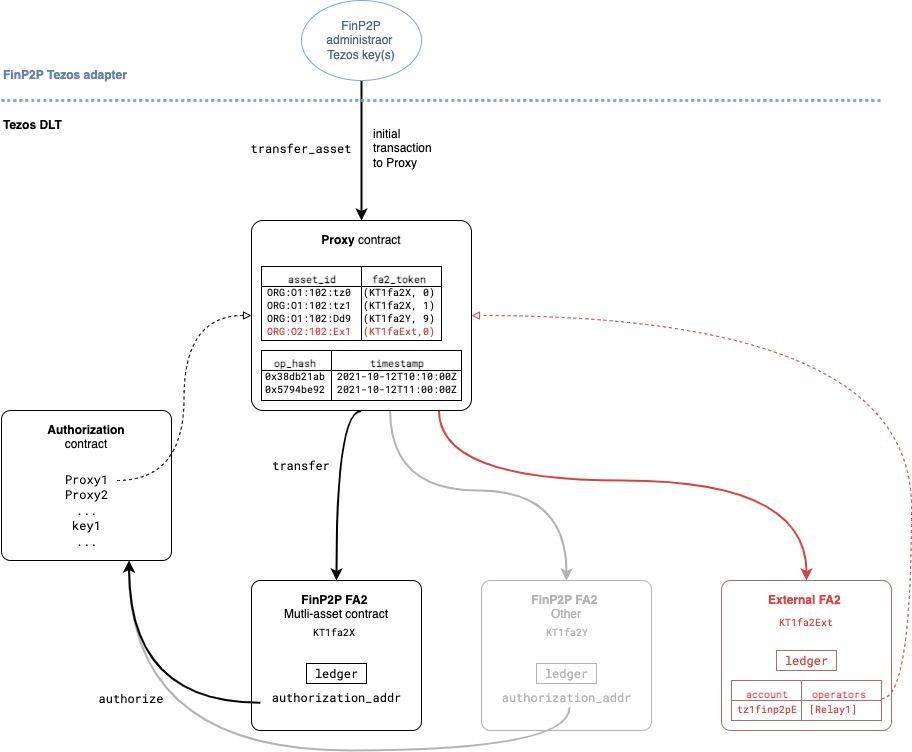

# Tezos adapter for FinP2P

The purpose of this adapter is to allow FinP2P users to move assets deployed on
Tezos. The main constraint being that not all nodes of the FinP2P network have a
Tezos adapter and thus not all nodes can access the Tezos blockchain.

This document describes the smart contracts architecture of the FinP2P adapter
on the Tezos blockchain.



## Design choice for assets

We will use the
[FA2](https://gitlab.com/tezos/tzip/-/blob/master/proposals/tzip-12/tzip-12.md)
standard to represent financial assets on Tezos. This is the latest standard and
now the most commonly used one for new projects. It is generally well supported
in the ecosystem (block-explorers, wallets, libraries, _etc._) and offers the
flexibility and extensibility that we seek.

In particular, it allows to represent _fungible_ assets, _non-fungible_ assets,
_semi-fungible_ assets (_i.e._ non-fungible assets, but each with a fixed amount
of fungible copies), and contracts with _multiple assets_.

Tokens are _owned_ by the Tezos address that correspond to the hash of the
public key of the user on the FinP2P network (we refer to this public key as
`finId` and to the hash as `finId_pkh` in the rest of the document).

For compliance with regulations, tokens on these asset contracts cannot be
transferred without restrictions.

We propose that all transfers go through a central **Authorization** contract
which allows, or not, the transfer to happen. In the first version (which we
call V1), this contract will contain a reference to a single relay contract (see
below). For future-proofing, we plan to make part of this contract updatable.

This means that, in V1, users cannot sign asset transfer operations (the Tezos
operations) directly (they have to go through the relay contract).

In V1, we also envision that we will only need one _mutli-asset_ contract to
handle all assets that will be issued on the FinP2P network. If the requirements
for this contract change later on, or if there are new kinds of asset that do
not fit in the implementation of the multi-asset FA2, we can always deploy new
(single- or multi-asset) FA2 contracts that will fit in the architecture.


### Stored information

To authorize operations on the FA2, it must store the address for the
**Authorization** contract. This address is **not** updatable as the
authorization contract can be updated in part.

It also needs to store the usual table for the ledger, the metadata, etc.

### Specs

The contract will have the following entry points:

- `transfer`
- `update_operators`
- `balance_of`
- `mint`
- `burn`

**Question**: Do we want more?

#### Authorization policy

Actions that are concerned by this policy will produce a call to the
**Authorization** contract with:
- the action parameters (e.g. source, destination, amount, for a transfer)
- the caller (in our case this will be the relay contract)
- the FA2 address

If this call fails, the whole action is reverted. Otherwise, the action is
executed (with the usual semantics).  Note that, for instance, we do not check
that the sender is the same address as the one that appears in the `from` field
of a transfer action (this is delegated to the authorization contract).

This authorization mechanism fits within the scope of [custom transfer
permission
policy](https://gitlab.com/tezos/tzip/-/blob/master/proposals/tzip-12/permissions-policy.md#customizing-transfer-permission-policy)
in the FA2 standard.

The FA2 contract metadata will contain a field `"permissions"` with the
following data (this is encoded as utf8 bytes in the storage of the contract,
but it will be displayed by block explorers and can possibly be used by
wallets).

```json
{
  "operator": "owner-or-operator",
  "receiver": "owner-no-hook",
  "sender": "owner-no-hook",
  "custom": {
    "tag": "finp2p2_authorization",
    "config-api": "address_of_authorization_contract" }
}
```

**TODO**: should we use the `no-transfer` policy (users cannot transfer tokens
directly) or have the `owner-or-operator` policy with the additional custom
policy.

#### `transfer`

Transferring tokens will produce a call to the **Authorization** contract at the
entry point `authorize` with the parameter:

```ocaml
{ 
  sender = "KT1relay";
  sender_is_operator = false;
  fa2_address = "KT1fa2X";
  parameters = Transfer [
    { from_ = src_account_pkh; 
      txs = [ {to_ = dst_account_pkh ; token_id; amount}] };
    ...
  ] 
} 
```

#### `mint`

The mint entry point is not part of the standard but we propose that it takes a
list of assets to be minted (so as to be more efficient if the relay changes and
allows for multiple mints at the same time).

```ocaml
type mint_param = {
  to_ : address;
  token_id : nat;
  amount : nat;
}

let mint
  (param, store : mint_param * storage) : (operation list * storage) = ...
```

Minting tokens will produce a call to the **Authorization** contract at the
entry point `authorize` with the parameter:

```ocaml
{ 
  sender = "KT1relay";
  fa2_address = "KT1fa2X";
  parameters = Mint [
    {to_ = dst_account_pkh ; token_id; amount};
    ...
  ] 
} 
```

The mint will create new tokens for the account `dst_account_pkh` (_i.e._ his
balance in this token will be incremented by `amount`).

#### `burn`

The burn entry point is not part of the standard but we propose that it takes a
list of assets to be burned (so as to be more efficient if the relay changes and
allows for multiple burns at the same time).

```ocaml
type burn_param = {
  from_ : address;
  token_id : nat;
  amount : nat;
}

let burn
  (param, store : burn_param * storage) : (operation list * storage) = ...
```

Burning tokens will produce a call to the **Authorization** contract at the
entry point `authorize` with the parameter:

```ocaml
{ 
  sender = "KT1relay";
  fa2_address = "KT1fa2X";
  parameters = Burn [
    {from_ = src_account_pkh ; token_id; amount};
    ...
  ] 
} 
```

The burn will remove tokens from the account `src_account_pkh` (_i.e._ his
balance in this token will be decremented by `amount`).

### `update_operators`

We think that we can keep the usual semantic (i.e. without calling the
authorization contract), where users must sign transaction themselves to update
their operators. This is for future proofing in case we want to relax the
restrictions. 

> The standard does not specify who is permitted to update operators on behalf
> of the token owner. Depending on the business use case, the particular
> implementation of the FA2 contract MAY limit operator updates to a token owner
> (`owner == SENDER`) or be limited to an administrator.

Note that a user having operators does not impact the contract in the V1.

**TODO**: decide if it is necessary or not (in the latter case there is no need
to have `sender_is_operator` as a parameter to the administrator contract).

### `balance_of`

This entry point implements the usual semantics:

> Gets the balance of multiple account/token pairs. Accepts a list of
> `balance_of_requests` and a callback contract callback which accepts a list of
> `balance_of_response` records.


## Relay contract

The **Relay** contract for FinP2P assets is deployed once and for all to
interact with the FinP2P FA2 contracts. The role of this contract is to check
for payload signatures (and ensure safety properties) and forward/relay calls to
the FA2 asset contracts.

This contract does not need to be updatable _per se_, but it can be replaced
with a new one by changing references to its address in other contracts. In
fact, it is only necessary to update the address in the **Authorization**
contract as the latter acts as an extra indirection layer.

### Stored information

To operate correctly, the **Relay** contract needs to keep track and maintain
the following information:

- a set of administrator addresses (updatable); only these administrators
  are allowed to inject `transfer_asset` and `issue_asset` operations
- a value `operation_ttl` in seconds that indicates how long an operation can be
  relayed depending on its timestamp (within the nonce); this value is updatable
  by an administrator and should match the retention policy of operations in the
  FinP2P network.
- a mapping of hashGroups to timestamps, called `live_opeations` which records
  (non-expired) operations that were relayed
- a mapping of FinP2P asset identifiers (of the form `<organization
  id>:<resource type>:<resource>`) to pairs of the form `(<KT1>, <id>)` where
  `<KT1>` is the address of the FA2 contract for this asset on Tezos and `<id>`
  is a natural number for this asset within the FA2 contract. Note that the
  FinP2P asset identifier can be opaque to the **Relay** contract (simply an
  ASCII string or a byte sequence, as long as they are unique within FinP2P).
  
<!--
- (optional) a mapping of account addresses (`tz2`) to public keys (_i.e._,
  `finId_pkh -> finId`)[^Necessary to check signatures as there are no builtin public key recovery mechanism in Tezos. Unless the source and destination of transfers are already identified by their full `finId`.]
-->

### Entry points

- `transfer_asset`
- `issue_asset`
- `redeem_asset`
- `cleanup`
- `update_administrator`
- `update_operation_ttl`
- `update_fa2_token`


#### Transfer Asset

```ocaml
type transfer_param = {
  nonce : bytes; (* 24 bytes *)
  nonce_timestamp : timestamp;
  asset_id : bytes;
  src_account : public_key;
  dst_account : public_key;
  amount : nat;
  shg : bytes; (* 32 bytes hash *)
  signature : signature;
}

let transfer_asset 
  (param, store : transfer_param * storage) : (operation list * storage)
= ...
```

This Tezos operation must be signed/injected by an administrator.

##### Signed Payload

> See [API reference](https://finp2p-docs.ownera.io/reference/transfertoken).

hashGroups = hash('BLAKE2B', [AHG, SHG]);

Signature = sign(sender private secp256k1 key, hashGroups)

###### Asset Hash Group (AHG) structure

AHG = hash('BLAKE2B', [fields by order]);

| order | value | type | comment |
|--|--|--|--|
| 1 | nonce           | []byte  |  |
| 2 | operation       | string  | "transfer" |
| 3 | assetType       | string  | "finp2p" |
| 4 | assetId         | string  | unique identifier of the asset |
| 5 | srcAccountType  | string  | "finId" |
| 6 | srcAccount      | string  | source account finId address  |
| 7 | dstAccountType  | string  | "finId" |
| 8 | dstAccount      | string  | destination account finId address  |
| 9 | amount          | string  | hex representation of the transfer amount |

###### Settlement Hash Group (SHG) structure

SHG = hash('BLAKE2B', [fields by order]);

| order | value | type | comment |
|--|--|--|--|
| 1 | assetType       | string  | "finp2p", "fiat", "cryptocurrency" |
| 2 | assetId         | string  | unique identifier of the asset |
| 3 | srcAccountType  | string  | "finId", "cryptoWallet", "escrow" |
| 4 | srcAccount      | string  | source account of the asset  |
| 5 | dstAccountType  | string  | "finId", "cryptoWallet", "escrow" |
| 6 | dstAccount      | string  | destination account for the asset  |
| 7 | amount          | string  | hex representation of the settlement amount |

#### Verifying transfer signatures

The entry point to transfer an asset (`transfer_asset`) does the following:

1. Check that the operation is still **live**, _i.e._ check that the `timestamp`
   plus the constant `operation_ttl` is still in the future and that the
   `timestamp` is in the past.
2. encode the parameter (without the signature) in bytes to recover the original
   signed message in the FinP2P node.
   - **Question**: Are the "string"s ascii or utf8? (answer seems to be utf8
     based on documentation)
   - We need to convert the timestamp to seconds from epoch (easy) then to int64
     big endian bytes (cumbersome but possible, need to encode by hand)
   - encode public_key to bytes (easy, pack then trim prefix)
   - convert the amount to hex string (must be done by hand) and encode this hex
     string to utf8 bytes (cumbersome as well).
3. Hash the produced bytes and ensure that it is not in our `live_operations`
   table.
   - **Question**: Should we exclude the SHG of the hash?
4. Register the hash -> timestamp in the `live_operations` table.
   - **Question**: Should we store the timestamp or the expiry date (depends on
     guarantees we want in case of `operation_ttl` update) ?
5. check that the encoded message was signed by the public key `src_account`
   [^Tezos requires the signature to be done on a `hashGroup` whose top hash is [BLAKE2b](https://en.wikipedia.org/wiki/BLAKE_(hash_function))]
6. retrieve the FA2 and token id corresponding to `asset_id`
7. call the `transfer` entry point of the FA2

Note that if one of the steps fails (_e.g._ the FA2 transfer), the whole
transaction is rolled back, and the storage of the smart contracts are
unchanged.

#### Issue Asset


```ocaml
type issue_asset_param = {
  nonce : bytes; (* 24 bytes *)
  nonce_timestamp : timestamp;
  asset_id : bytes;
  dst_account : public_key;
  amount : nat;
  shg : bytes; (* 32 bytes hash *)
  signature : signature;
  fa2_token: (address * nat);
}

let issue_asset
  (param, store : issue_asset_param * storage) : (operation list * storage)
= ...
```

This Tezos operation must be signed/injected by an administrator.

##### Payload

> See [API reference](https://finp2p-docs.ownera.io/reference/issuetoken).

hashGroups = hash('BLAKE2B', [AHG, SHG]);

Signature = sign(sender private secp256k1 key, hashGroups)

###### Asset Hash Group (AHG) structure

AHG = hash('BLAKE2B', [fields by order]);

| order | value | type | comment |
|--|--|--|--|
| 1 | nonce | []byte | 
| 2 | operation | string | "issue"
| 3 | assetType | string | "finp2p"
| 4 | assetId | string | unique identifier of the asset
| 5 | dstAccountType | string | "finId"
| 6 | dstAccount | string | destination account finId address hex representation
| 7 | amount | string | hex (prefixed with 0x) representation of the issuance amount

###### Settlement Hash Group (SHG) structure:

SHG = hash('BLAKE2B', [fields by order]);

order | value | type | comment
|--|--|--|--|
| 1 | assetType | string | "finp2p", "fiat", "cryptocurrency"
| 2 | assetId | string | unique identifier of the asset
| 3 | srcAccountType | string | "finId", "cryptoWallet", "escrow"
| 4 | srcAccount | string | source account of the asset
| 5 | dstAccountType | string | "finId", "cryptoWallet", "escrow"
| 6 | dstAccount | string | destination account for the asset
| 7 | amount | string | hex representation of the settlement amount
| 8 | expiry | string | hex representation of the escrow hold expiry value

#### Verifying asset issuance signature

The entry point to issue a new asset (`issue_asset`) does the following:

1. Do the same steps 1-4 of [transfer asset](#verifying-asset-signatures)
5. check that the encoded message was signed by the public key `dst_account`
   - **Question**: can anyone issue assets? (_i.e._ is this check ok?)
6. store the `asset_id` with `fa2_token` and check if does not already exist
7. call the `mint` entry point of the FA2
   - **Question**: What token metadata? 
     - decimals (mandatory)
     - name (= asset_id?)
     - symbol
     - URI to external metadata


### Redeem Asset

```ocaml
type redeem_asset_param = {
  nonce : bytes; (* 24 bytes *)
  nonce_timestamp : timestamp;
  asset_id : bytes;
  quantity : nat;
  signature : signature;
  src_account : public_key;
}

let redeem_asset
  (param, store : issue_asset_param * storage) : (operation list * storage)
= ...
```

This Tezos operation must be signed/injected by an administrator.

##### Signed Payload

> See [API reference](https://finp2p-docs.ownera.io/reference/redeemtoken).

Signature = sign(sender private secp256k1 key, message)

|order|value|type|comment|
|---|---|---|---|
|1|nonce|[]byte|	
|2|	"redeem"|	string|	name of the method|
|3|	assetId	|string	|
|4|	quantity|	string|	hex representation of the quantity

#### Verifying asset redeem signature

The entry point to redeem an existing asset (`redeem_asset`) does the following:

1. Do the same steps 1-4 of [transfer asset](#verifying-asset-signatures)
   excepted that the `src_account` is not part of the signed payload (but it
   still need to be passed as a parameter to the Tezos transaction in order to
   check the signature and to burn tokens from the correct signer)
5. check that the encoded message was signed by the public key `src_account`
7. call the `burn` entry point of the FA2


### Clean up

The space used by the operation hashes and their timestamps can be reclaimed by
removing the ones that expired, _i.e._ the ones whose timestamp plus
`operation_ttl` is before the current time (the timestamp of the previous
block).

```ocaml
let cleanup
  (param, store : bytes list * storage) : (operation list * storage)
= ...
```

The parameter to this entry point is a list of operation hashes (as stored in
[Transfer Asset](#transfer-asset) and [Issue Asset](#issue-asset)). The code for
`cleanup` removes expired operations of this list from `live_operations`. (It
need not fail, but simply skip, operations which are not expired.) The total
storage used by a contract is computed with a _high water mark_ which means that
if we make it decrease in one transaction, then the additional bytes stored
below this _high water mark_ will be free.

Note that because big_map's in Tezos cannot be iterated, we have to provide this
list.

This entry point can be called by anybody (the caller will pay the fees to
cleanup the table). In practice, this would be called by daemon at regular
intervals.

In V1, we do not need to have this daemon operational right away because there
is no risk of this table being too big and hindering the execution of the smart
contracts. Big map's in Tezos (alike "mappings" in Ethereum) are never fully
deserialized, but rather accessed on demand, which means we pay the
deserialization gas only when retrieving (or updating) a value from the map.

### Update administrators

```ocaml
let update_administrators 
  (param, store : address set * storage) : (operation list * storage)
= ...
```

This is callable only by an administrator. We will use a configurable
multi-signature scheme if desired for this.

**TODO**: we can probably reuse the administrators field of the
**Authorization** contract by adding an extra "authorization kind" `Admin`.
This would prevent to have the same information/code in two places, but it might
not be desirable to have this coupling.


### Update `operation_ttl`

```ocaml
let update_operation_ttl 
  (new_operation_ttl, store : nat * storage) : (operation list * storage)
= ...
```

This is callable only by an administrator. This does not need a multi-signature
scheme at first glance.

**TODO**: group other updatable configuration information for the Relay here.

### Update FA2 token for an asset

```ocaml
type update_fa2_token_param = {
  asset_id : bytes;
  fa2_token : (address * nat);
}

let update_fa2_token 
  (param, store : update_fa2_token_param * storage) : (operation list * storage)
= ...
```

This is callable only by an administrator. This does not need a multi-signature
scheme at first glance. It should allow for an administrator to update the FA2
contract address (and/or it's token id) for an asset that is already registered
in the table.

This is useful in case we want to update one or more FA2 contract to a new
implementation (note that the update, and the migration of the data
contained in the FA2, including the ledger, etc. should be done beforehand,
either manually or by the FinP2P Tezos adapter).

## Authorization contract

The authorization contract acts as an indirection point for the FA2 contracts to
access the Relay contract (the relay can be replaced). It will receive
authorization requests from the FA2 asset contracts (see [Authorization
policy](#authorization-policy)).

### Stored information

This contract needs at least to know the address of the Relay contract. In the
most basic version, it simply checks if the `sender` field in the authorization
requests corresponds to the Relay contract and rejects the others.

However, for flexibility and future-proofing, the address of the Relay contract
can be updated and the authorization logic can be updated as well.

In particular, we want
- a set of administrators (addresses) for this contract
- a table `accredited` (big map) of addresses to bytes (the associated bytes
  value will be empty at the beginning but can contain arbitrary encoded
  information in the long run); this table is initialized with the Relay
  contract address
- a field to store a lambda which records the (updatable) code for the
  authorization logic.
  
### Entry points

- `authorize`
- `update_accredited`
- `update_authorization_logic`
- `update_administrator`

### `authorize`

```ocaml
type authorize_fa2_param =
| Transfer of fa2_transfer_param
| Mint of fa2_transfer_mint
| Burn of fa2_transfer_burn
| ...

type authorize_param = {
  sender : address;
  sender_is_operator : bool;
  fa2_address : address;
  parameters = authorize_fa2_param;
}

let authorize
  (param * store : authorize_param * storage) :
  (operation list * storage) = ...
```

The code for this entry point will simply retrieve the authorization logic from
the storage and apply it to its parameter. The initial authorization logic will
contain a function which simply checks if the `sender` is in the table
`accredited`.

#### `update_accredited`

```ocaml
let update_accredited
  (param * store : (address * bytes option) * storage) :
  (operation * storage) = ...
```

This is callable only by an administrator. We will use a configurable
multi-signature scheme if desired for this.

#### `update_authorization_logic`

```ocaml
let update_authorization_logic
  (param * store : 
    (authorize_param * storage -> operation list * storage) * storage) :
  (operation list * storage) = ...
```

This is callable only by an administrator. We will use a configurable
multi-signature scheme if desired for this.

